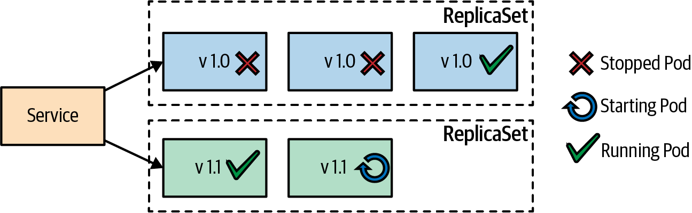
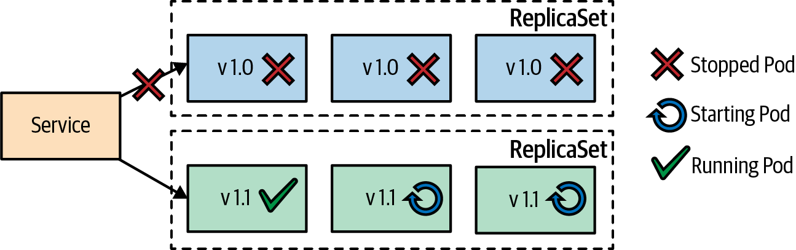
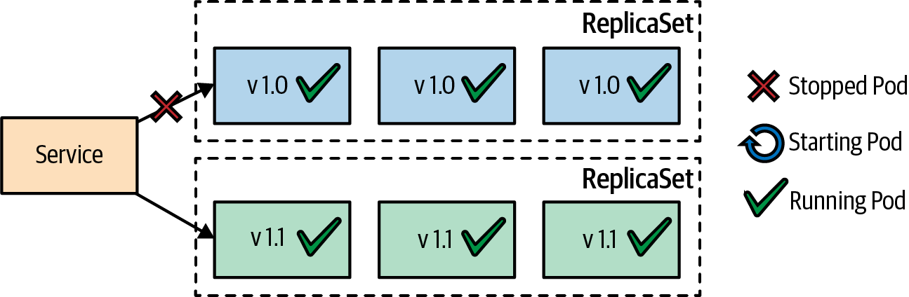
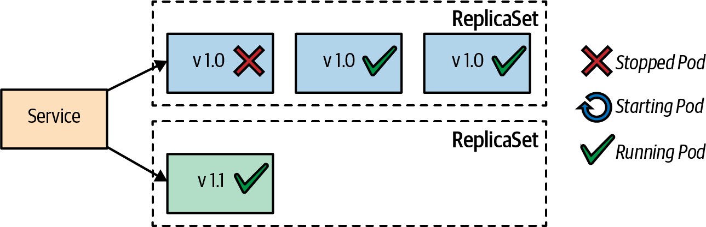
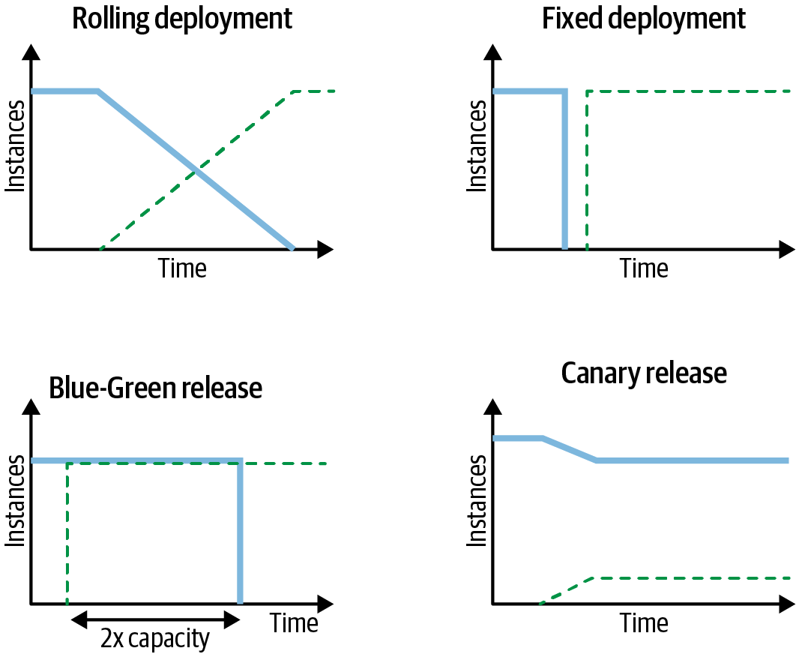

# Kubernetes Deployment Patterns

## Chapter 3: Declarative Deployment

### Problem
As the number of microservices grows, the manual process of upgrading services—including starting the new Pod version, gracefully stopping the old one, verifying successful launches, and rolling back if necessary—becomes burdensome. Manual steps can lead to human errors, and scripting them requires significant effort. Kubernetes addresses this challenge with the **Deployment** resource, which automates application upgrades and makes them repeatable and efficient【13:0†source】【13:6†source】.

### Solution
The Kubernetes Deployment resource abstracts the complexities of managing upgrades and rollbacks of container groups. By defining the desired state, Kubernetes performs necessary actions to ensure the system conforms to that state. Deployment strategies supported include:

#### Rolling Deployment
The default strategy that updates Pods incrementally to ensure zero downtime. It creates new Pods while progressively replacing old ones, adhering to parameters like `maxSurge` (temporary additional Pods) and `maxUnavailable` (maximum Pods unavailable during updates). Example configuration:[^1]

```yaml
apiVersion: apps/v1
kind: Deployment
metadata:
  name: rolling-deployment
spec:
  replicas: 3 [^1]
  strategy:
    type: RollingUpdate
    rollingUpdate:
      maxSurge: 1
      maxUnavailable: 1
  selector:
    matchLabels:
      app: rolling-app
  template:
    metadata:
      labels:
        app: rolling-app
    spec:
      containers:
      - name: rolling-app
        image: app-image:v1
        readinessProbe:
          exec:
            command: ["stat", "/tmp/app-ready"]
```
1. Declaration of three replicas. You need more than one replica for a rolling update
to make sense.
2. Number of Pods that can be run temporarily in addition to the replicas specified
during an update. In this example, it could be a maximum of four replicas.
3. Number of Pods that may be unavailable during the update. Here it could be that
only two Pods are available at a time during the update.
4. Duration in seconds of all readiness probes for a rolled-out Pod needs to be
healthy until the rollout continues.
5. Readiness probes that are very important for a rolling deployment to ensure zero downtime

*Figure 3-1. Rolling deployment strategy.*



#### Recreate Deployment
This strategy stops all existing Pods before starting new ones, ensuring no overlap but introducing downtime【13:9†source】.

*Figure 3-2. Fixed deployment using a Recreate strategy.*



#### Blue-Green Deployment
This strategy minimizes downtime by deploying a new version in parallel with the existing one. Once verified, traffic switches to the new version by updating the Service selector. Resources for the old version can then be released【13:1†source】【13:6†source】.

*Figure 3-3. Blue-Green release.*



#### Canary Release
This approach gradually introduces a new version to a subset of users. If successful, it replaces the old version entirely. It involves managing two Deployments and adjusting traffic split using service mesh or ingress controllers【13:6†source】.

*Figure 3-4. Canary release.*



### Advanced Deployment Strategies

#### Pre- and Post-Deployment Hooks
These hooks were proposed to allow custom commands during deployments but are not fully implemented in Kubernetes. Current alternatives include higher-level abstractions using operators【13:0†source】.

#### Higher-Level Platforms
Platforms like Flagger (part of Flux CD), Argo Rollouts, and Knative provide advanced deployment strategies, integrating canary and blue-green mechanisms while supporting traffic splitting and rollbacks【13:5†source】.

### Benefits of Declarative Deployment
- **Automation**: Reduces manual intervention and human error.
- **Repeatability**: Ensures consistent results across environments.
- **Observability**: Provides monitoring capabilities and rollback mechanisms.
- **Declarative Nature**: Focuses on desired state rather than procedural steps【13:0†source】.

### Conclusion
Kubernetes’ Deployment abstraction simplifies service upgrades, balancing downtime, resource utilization, and operational risks. Advanced tools further enhance its capabilities, making it suitable for modern, scalable application environments【13:6†source】.

*Figure 3-5. Deployment and release strategies.*


