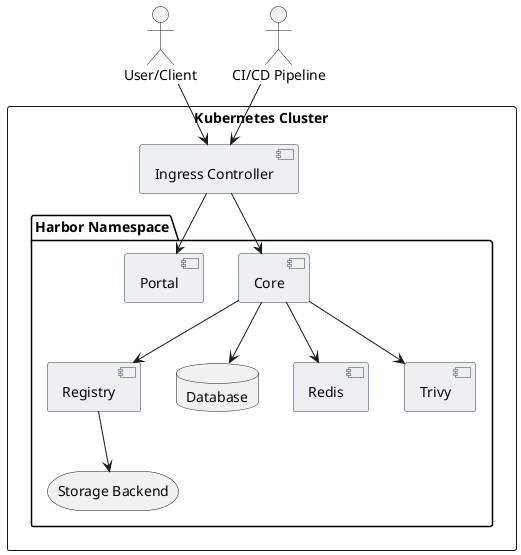

# Harbor Registry Deployment Guide

Harbor is an open source registry that secures artifacts with policies and role-based access control, ensures images are scanned and free from vulnerabilities, and signs images as trusted.

## Quick Steps

1. Prerequisites:
   - Kubernetes cluster
   - Helm 3.x
   - Domain name for Harbor
   - SSL certificate (optional for production)

2. Installation:
   ```bash
   # Add Harbor Helm repository
   helm repo add harbor https://helm.goharbor.io
   helm repo update

   # Create namespace
   kubectl create namespace harbor

   # Install Harbor
   helm install harbor harbor/harbor \
     --namespace harbor \
     --set expose.type=ingress \
     --set expose.tls.enabled=true \
     --set externalURL=https://harbor.yourdomain.com
   ```

3. Verify Installation:
   ```bash
   kubectl get pods -n harbor
   ```

## Architecture Overview



## Detailed Deployment Steps

### 1. Prerequisites Setup

1. Ensure Kubernetes cluster is running:
   ```bash
   kubectl cluster-info
   ```

2. Install Helm if not already installed:
   ```bash
   curl https://raw.githubusercontent.com/helm/helm/master/scripts/get-helm-3 | bash
   ```

3. Prepare storage class (if using cloud provider, skip this step):
   ```bash
   kubectl apply -f - <<EOF
   apiVersion: storage.k8s.io/v1
   kind: StorageClass
   metadata:
     name: harbor-storage
   provisioner: kubernetes.io/no-provisioner
   volumeBindingMode: WaitForFirstConsumer
   EOF
   ```

### 2. Configuration

1. Create values.yaml for Harbor configuration:
   ```yaml
   expose:
     type: ingress
     tls:
       enabled: true
     ingress:
       hosts:
         core: harbor.yourdomain.com
       annotations:
         kubernetes.io/ingress.class: nginx
   
   persistence:
     enabled: true
     storageClass: "harbor-storage"
   
   harborAdminPassword: "your-secure-password"
   
   database:
     type: internal
     internal:
       password: "your-db-password"
   ```

2. Install Harbor using Helm:
   ```bash
   helm install harbor harbor/harbor \
     --namespace harbor \
     --create-namespace \
     -f values.yaml
   ```

### 3. Post-Installation

1. Verify all pods are running:
   ```bash
   kubectl get pods -n harbor
   ```

2. Configure DNS or add to hosts file:
   ```bash
   echo "$(kubectl get svc harbor-ingress -n harbor -o jsonpath='{.status.loadBalancer.ingress[0].ip}') harbor.yourdomain.com" | sudo tee -a /etc/hosts
   ```

3. Access Harbor Portal:
   - URL: https://harbor.yourdomain.com
   - Default credentials:
     - Username: admin
     - Password: Harbor12345 (or the one set in values.yaml)

### 4. Configure Docker Client

1. Add Harbor's certificate to Docker:
   ```bash
   sudo mkdir -p /etc/docker/certs.d/harbor.yourdomain.com
   sudo cp ca.crt /etc/docker/certs.d/harbor.yourdomain.com/
   ```

2. Login to Harbor:
   ```bash
   docker login harbor.yourdomain.com
   ```

3. Push an image:
   ```bash
   docker tag nginx:latest harbor.yourdomain.com/library/nginx:latest
   docker push harbor.yourdomain.com/library/nginx:latest
   ```

## Security Considerations

1. Change default admin password immediately
2. Enable RBAC and create projects with appropriate permissions
3. Configure vulnerability scanning with Trivy
4. Enable image signing for trusted content
5. Regular backup of Harbor data

## Troubleshooting

Common issues and solutions:

1. Pod startup issues:
   ```bash
   kubectl describe pod <pod-name> -n harbor
   kubectl logs <pod-name> -n harbor
   ```

2. Storage issues:
   - Check PVC status:
     ```bash
     kubectl get pvc -n harbor
     ```
   - Verify StorageClass:
     ```bash
     kubectl get sc
     ```

3. Ingress issues:
   - Verify ingress configuration:
     ```bash
     kubectl get ingress -n harbor
     kubectl describe ingress -n harbor