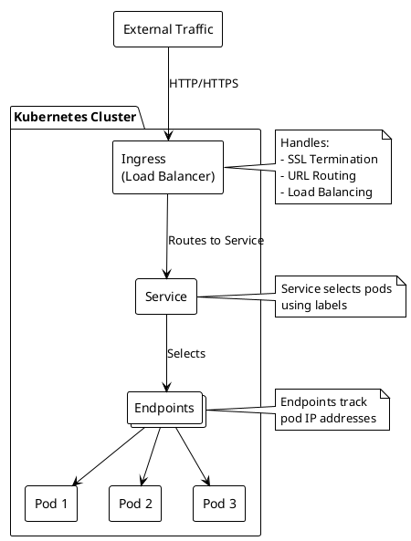

# Kubernetes Ingress

An Ingress is a Kubernetes resource that manages external access to services in a cluster. It provides HTTP/HTTPS routing, SSL termination, and name-based virtual hosting.

## Complete Example

Here's a complete example showing the full stack of Pod, ConfigMap, Service, and Ingress:

```yaml
# First file: pod-and-configmap.yaml
apiVersion: v1
kind: Pod
metadata:
  name: test-pod
  labels:
    app: endpoint-test
spec:
  containers:
    - name: web-server
      image: nginx:alpine
      ports:
        - containerPort: 80
      volumeMounts:
        - name: html-volume
          mountPath: /usr/share/nginx/html
  volumes:
    - name: html-volume
      configMap:
        name: test-html
---
apiVersion: v1
kind: ConfigMap
metadata:
  name: test-html
data:
  index.html: |
    <html>
    <head><title>Test Page</title></head>
    <body><h1>Hello, Kubernetes!</h1></body>
    </html>
---
# Second file: service.yaml
apiVersion: v1
kind: Service
metadata:
  name: test-pod-service
spec:
  selector:
    app: endpoint-test
  ports:
    - protocol: TCP
      port: 80
      targetPort: 80
  type: ClusterIP
---
# Ingress with path
apiVersion: networking.k8s.io/v1
kind: Ingress
metadata:
  name: test-ingress
  annotations:
    nginx.ingress.kubernetes.io/rewrite-target: /
spec:
  rules:
  - host: fuck
    http:
      paths:
      - path: /test
        pathType: Prefix
        backend:
          service:
            name: test-pod-service
            port:
              number: 80
```

## How Ingress, Endpoints, and Pods Interlink



### Understanding the Connection Flow

Let's analyze how each component in our YAML example works together:

1. **Pod Configuration** (First YAML section):
   ```yaml
   metadata:
     name: test-pod
     labels:
       app: endpoint-test   # This label is key for Service selection
   ```
   - Defines a Pod running nginx with a custom HTML page
   - Uses the label `app: endpoint-test` which is crucial for Service discovery
   - Mounts a volume from ConfigMap to serve custom content

2. **ConfigMap Integration** (Second YAML section):
   ```yaml
   volumes:
     - name: html-volume
       configMap:
         name: test-html   # Links to the ConfigMap
   ```
   - Provides the HTML content that the Pod will serve
   - Connected to the Pod through volume mounting
   - Demonstrates configuration separation from the Pod

3. **Service Layer** (Third YAML section):
   ```yaml
   spec:
     selector:
       app: endpoint-test   # Matches Pod's label
     ports:
       - port: 80          # Service port
         targetPort: 80    # Pod port
   ```
   - Creates a stable network endpoint for the Pod
   - Uses label selector `app: endpoint-test` to find our Pod
   - Maps port 80 on the service to port 80 on the Pod

4. **Ingress Configuration** (Fourth YAML section):
   ```yaml
   spec:
     rules:
     - host: example.local
       http:
         paths:
         - path: /test    # URL path
           backend:
             service:
               name: test-pod-service   # References Service name
   ```
   - Defines external access rules
   - Routes `/test` path to our Service
   - References the Service by name: `test-pod-service`

### Key Relationships in the Stack

1. **Pod → Service Connection**:
   - Pod's label `app: endpoint-test` matches Service's selector
   - Service automatically discovers Pod through this label matching
   - If Pod is recreated with same labels, Service automatically finds it

2. **Service → Ingress Connection**:
   - Ingress backend references Service by name: `test-pod-service`
   - Traffic flow: Ingress → Service → Pod
   - Service provides stable internal endpoint regardless of Pod changes

3. **ConfigMap → Pod Connection**:
   - Pod mounts ConfigMap as volume
   - Changes to ConfigMap can update Pod's content without rebuild
   - Separates configuration from application container

This interconnected system provides:
- Dynamic service discovery through labels
- Load balancing across multiple Pods (if scaled)
- External access control through Ingress rules
- Configuration management through ConfigMaps