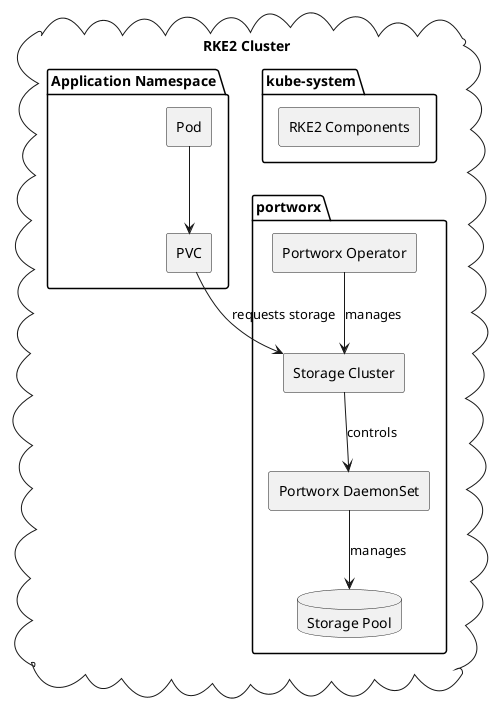

# Portworx on SUSE Leap 15.5 with RKE2

This guide provides instructions for deploying Portworx on SUSE Leap 15.5 with RKE2 Kubernetes cluster.

## Quick Start

```bash
# Install required packages
zypper install -y docker python3-pip

# Start and enable docker service
systemctl enable --now docker

# Download Portworx Spec Generator
curl -o px-spec.yaml "https://install.portworx.com/2.13?mc=false&kbver=v1.28.2&b=true&c=px-cluster-1&stork=true&csi=true&pxOperator=true&ns=portworx&osft=true&type=oci&ociPassphrase=&ociUsername=&ociSecret=&ociSecretNamespace=&ociEndpoint=&st=k8s&promop=true"

# Apply the spec
kubectl apply -f px-spec.yaml
```

## Deployment Architecture



## Manifest Components

| Component | Type | Purpose |
|-----------|------|---------|
| portworx-operator | Deployment | Manages the Portworx cluster lifecycle |
| portworx | DaemonSet | Runs Portworx storage on each node |
| px-cluster | StorageCluster | Defines the Portworx storage cluster configuration |
| stork | Deployment | Storage orchestration for Kubernetes |
| stork-scheduler | Deployment | Custom scheduler for Portworx volumes |
| px-api | Service | Exposes Portworx API |
| portworx-service | Service | Internal communication service |

## Available StorageClasses

Portworx creates several StorageClasses by default:

| StorageClass | Description |
|--------------|-------------|
| px-replicated | Replication factor of 3 for high availability |
| px-secure-sc | Encrypted volumes with replication |
| px-db-sc | Optimized for database workloads |
| px-shared-sc | ReadWriteMany volumes for shared access |

### Sample PVC Definitions

```yaml
# High Availability PVC
apiVersion: v1
kind: PersistentVolumeClaim
metadata:
  name: px-ha-pvc
spec:
  accessModes:
    - ReadWriteOnce
  storageClassName: px-replicated
  resources:
    requests:
      storage: 10Gi
---
# Encrypted Volume PVC
apiVersion: v1
kind: PersistentVolumeClaim
metadata:
  name: px-secure-pvc
spec:
  accessModes:
    - ReadWriteOnce
  storageClassName: px-secure-sc
  resources:
    requests:
      storage: 20Gi
---
# Shared Volume PVC
apiVersion: v1
kind: PersistentVolumeClaim
metadata:
  name: px-shared-pvc
spec:
  accessModes:
    - ReadWriteMany
  storageClassName: px-shared-sc
  resources:
    requests:
      storage: 50Gi
```

## Verification

To verify the Portworx installation:

```bash
# Check Portworx pods
kubectl get pods -n portworx

# Verify StorageClasses
kubectl get sc

# Check Portworx status
PX_POD=$(kubectl get pods -l name=portworx -n portworx -o jsonpath='{.items[0].metadata.name}')
kubectl exec -n portworx $PX_POD -- /opt/pwx/bin/pxctl status