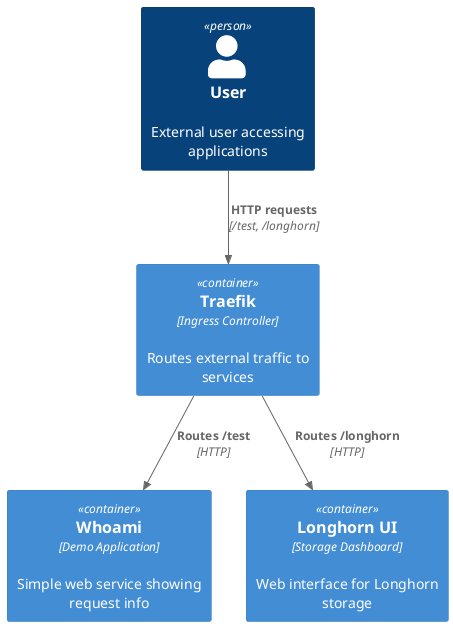

# Traefik on RKE2

## Summary
This guide demonstrates how to deploy Traefik as an ingress controller on RKE2 Kubernetes cluster, including sample configurations for routing traffic to applications.

## Quick Start
```bash
# Deploy sample web application
kubectl create deployment whoami --image=traefik/whoami
kubectl expose deployment whoami --port=80

# Create test ingress route
cat <<EOF | kubectl apply -f -
apiVersion: traefik.containo.us/v1alpha1
kind: IngressRoute
metadata:
  name: whoami-route
spec:
  entryPoints:
    - web
  routes:
    - match: PathPrefix(`/test`)
      kind: Rule
      services:
        - name: whoami
          port: 80
EOF

# Create Longhorn ingress route
cat <<EOF | kubectl apply -f -
apiVersion: traefik.containo.us/v1alpha1
kind: IngressRoute
metadata:
  name: longhorn-route
spec:
  entryPoints:
    - web
  routes:
    - match: PathPrefix(`/longhorn`)
      kind: Rule
      services:
        - name: longhorn-frontend
          port: 80
EOF
```

## Architecture


## Detailed Configuration

### 1. Verify Traefik Installation
RKE2 comes with Traefik installed by default. Verify the installation:

```bash
kubectl get pods -n kube-system | grep traefik
```

### 2. Deploy Sample Application
Deploy the whoami application which will serve as our test endpoint:

```yaml
# whoami-deployment.yaml
apiVersion: apps/v1
kind: Deployment
metadata:
  name: whoami
spec:
  replicas: 2
  selector:
    matchLabels:
      app: whoami
  template:
    metadata:
      labels:
        app: whoami
    spec:
      containers:
      - name: whoami
        image: traefik/whoami
        ports:
        - containerPort: 80
---
apiVersion: v1
kind: Service
metadata:
  name: whoami
spec:
  ports:
  - port: 80
    targetPort: 80
  selector:
    app: whoami
```

Apply the configuration:
```bash
kubectl apply -f whoami-deployment.yaml
```

### 3. Configure Test Route
Create an IngressRoute for the whoami service:

```yaml
# whoami-route.yaml
apiVersion: traefik.containo.us/v1alpha1
kind: IngressRoute
metadata:
  name: whoami-route
spec:
  entryPoints:
    - web
  routes:
    - match: PathPrefix(`/test`)
      kind: Rule
      services:
        - name: whoami
          port: 80
```

Apply the route:
```bash
kubectl apply -f whoami-route.yaml
```

### 4. Configure Longhorn UI Route
Create an IngressRoute for the Longhorn frontend:

```yaml
# longhorn-route.yaml
apiVersion: traefik.containo.us/v1alpha1
kind: IngressRoute
metadata:
  name: longhorn-route
spec:
  entryPoints:
    - web
  routes:
    - match: PathPrefix(`/longhorn`)
      kind: Rule
      services:
        - name: longhorn-frontend
          port: 80
```

Apply the route:
```bash
kubectl apply -f longhorn-route.yaml
```

### 5. Verify Routes
Test the configurations:

```bash
# Get Traefik service NodePort
kubectl get svc -n kube-system traefik

# Test whoami endpoint
curl http://<node-ip>:<nodeport>/test

# Access Longhorn UI
curl http://<node-ip>:<nodeport>/longhorn
```

## Troubleshooting

### Check Traefik Logs
```bash
kubectl logs -n kube-system -l app.kubernetes.io/name=traefik
```

### Verify IngressRoutes
```bash
kubectl get ingressroutes
kubectl describe ingressroute whoami-route
kubectl describe ingressroute longhorn-route
```

### Common Issues
1. **404 Not Found**: Verify service names and ports in IngressRoute configuration
2. **503 Service Unavailable**: Check if target pods are running and ready
3. **Path not working**: Ensure PathPrefix in IngressRoute matches the request path
